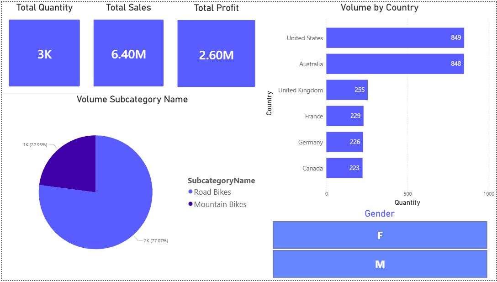

# 📊 Sales Analysis Dashboard
## 📌 Business Problem
The company lacks visibility into its sales performance across different regions and products. 
There is no clear understanding of which products generate the most profit or which customer segments are most valuable.
The company wants to understand which products are causing losses due to high returns and the rate of increase each year.
## 📊 Project Overview
This project analyzes sales data from 2020 to 2022 using Power BI to provide insights into sales performance, customer behavior, and product trends.
## 🎯 Objectives
- Identify top-selling products
- Identify top-Returning products & Returns over years
- Understand customer behavior
- Track sales trends over years
## 🛠️ Tools Used
- Microsoft Power BI
- DAX
- Data Modeling
- CSV Files
## 📂 Dataset
The dataset includes:
- Sales Data (2020, 2021, 2022)
- Customer Data
- Product Data (Categories , Subcategories)
- Territory Data
- Returns Data
- Calendar
## 🧩 Data Model
The data model follows a star schema with a central product fact table connected to dimension tables such as customers,return data and regions.

## 📊 Dashboard Features

- KPI Cards (Total Profit, Total Quantity)
- Volume analysis by country
- Product category distribution
- Time-based sales trends
- Gender filter (Slicer)
- Top N analysis (Top 3 filter)
- Interactive dashboard with slicers
- Analysis return quantity by years & country
## 🖼️ Dashboard Preview

## 🧠 Key Insights
- The United States generates the highest sales
- Accessories category dominates sales
- Sales increase over time
- Middle age Customer dominates Sales
- Universal product style dominates Sales
## ▶️ How to Use
1. Download the .pbix file
2. Open it in Power BI Desktop
3. Use filters and slicers to explore the data
## 📁 Project Structure
powerbi-sales-analysis
│
├── docs
├── data
├── dashboard
├── images
└── README.md
## 🚀 Future Improvements
- Add more KPIs
-  Return Rate % analysis
- Add predictive analysis
## 👤 Author
Uosef Eissa
